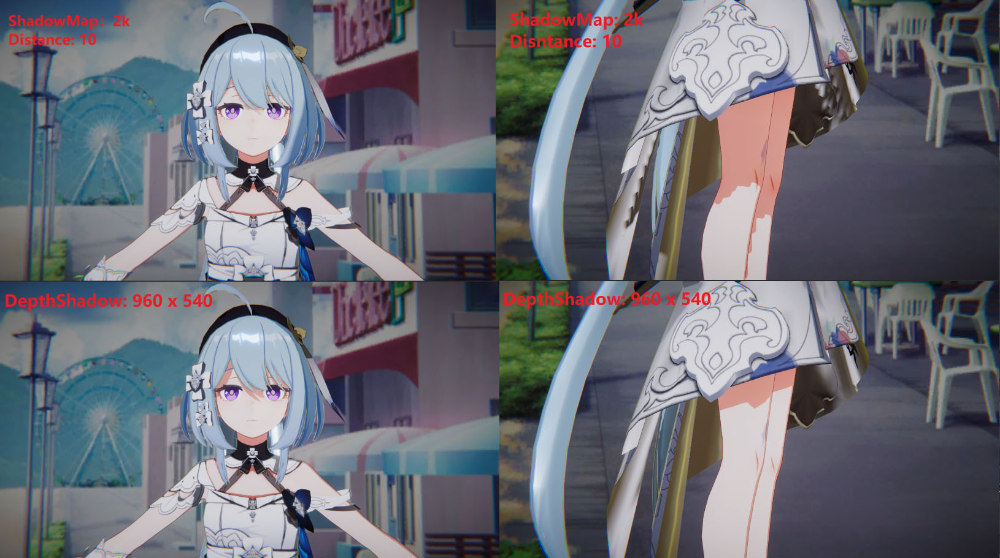
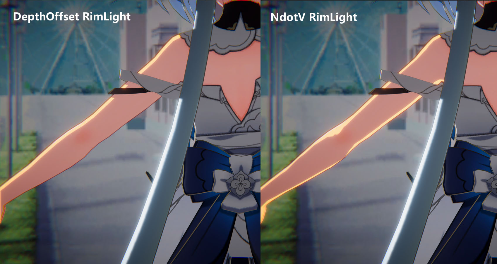
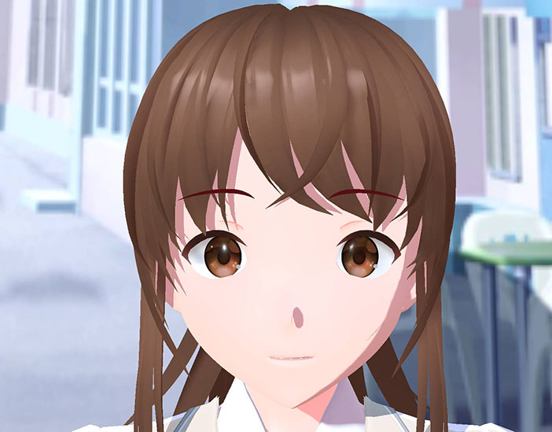

# FernNPR

[中文](https://github.com/DeJhon-Huang/FernNPR/blob/master/README_CN.md) | [English](https://github.com/DeJhon-Huang/FernNPR/blob/master/README.md)

FernNPR is a NPR rendering library in Unity, not just cartoon rendering, It will include as many non-realistic rendering techniques as possible.

It will be an easily scalable, multi-platform (PC/Mobile) rendering library.

## Render Example
There are some simple scenes.

### NPR Character

Model From: [模之屋](https://www.aplaybox.com/details/model/S5d7KiigvyIb)

Background From: [GameVision Studios](https://gamevision.artstation.com/projects/ZGZxYG)

### Material Example

FernNPR can easy get various styles of materials, including NPR and PBR.

Forward+ Test (branches:2022.2_urp)

https://user-images.githubusercontent.com/18584942/220602754-7757590b-0650-4740-b4e5-a2133d8eda02.mp4

### Angle Ring Specular

https://user-images.githubusercontent.com/18584942/218261848-3d283271-2154-45cc-954f-cc34aa2f77a2.mp4

### Face Shading

**SDF Face**

https://user-images.githubusercontent.com/18584942/218262153-0784eda7-ebb2-4ae2-a367-227398a90b01.mp4

### Depth Shadow 

Use trick of depth to get Clear shadow

### Depth Offset Rim

Depth Offset allows Rim Light's width to remain consistent in screen space.

### Edge Detection Outline

https://user-images.githubusercontent.com/18584942/218262271-ea9615c9-b935-4189-b568-68d89e763aa1.mp4

### Some Feature

Eyebrow 

#### Roadmap

Roadmap: https://rookiefern.notion.site/8bd6fd0ba54143c082f1f2cdebc36dd9?v=888f4efdebbe4254828f0a383eac401e

## Related links

- [知乎专栏](https://www.zhihu.com/column/c_1587028302690304000)

- [LWGUI](https://github.com/JasonMa0012/LWGUI)

- [VRoid Studio](https://vroid.com/en)
