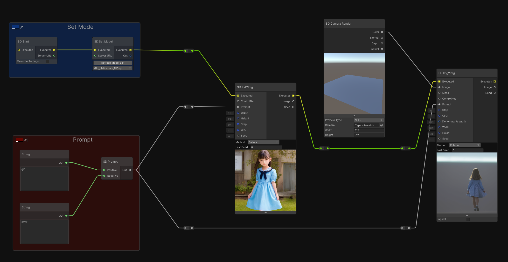
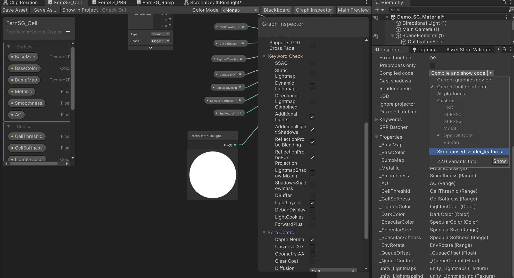
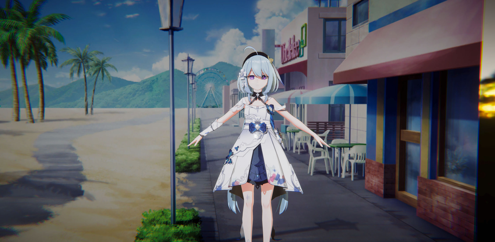
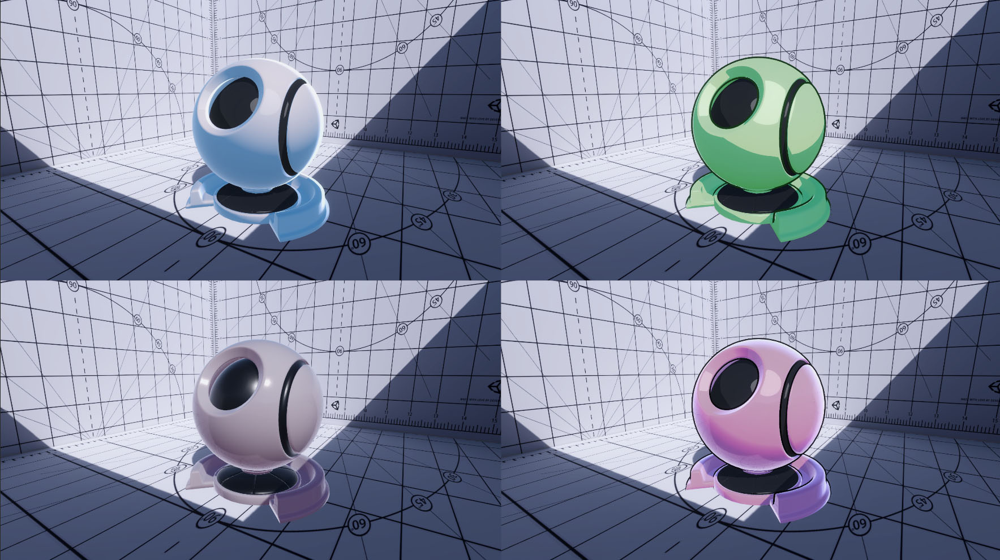
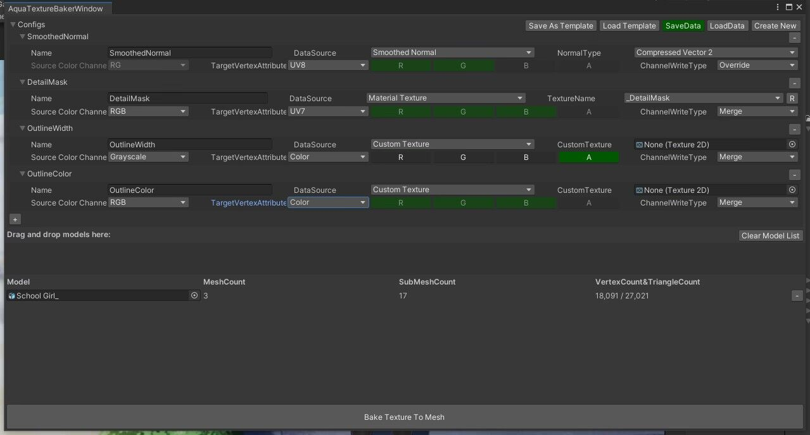

------------------------------------

# FernNPR

[中文](https://github.com/DeJhon-Huang/FernNPR/blob/master/README_CN.md) | [English](https://github.com/DeJhon-Huang/FernNPR/blob/master/README.md)

FernNPR is a library for non-photorealistic rendering (NPR) in Unity. It offers a variety of NPR techniques, Character Renderering, Environmental Renderering, and Stable Diffusion!

## About The Pro Version

Please note that this open source project on Github is a free version that provides basic implementation. We are developing the Pro version and will release in Unity Asset Store.

**Pro Version is Comming Soon, Please follow the website**
- [爱发电](https://afdian.net/a/FernRender)
- Patreon (Not yet registered)

### There are some feature in Pro Version

**ControlNet**

**Prompt Generator**

**New UI**

**Shader Graph Templete**

For more features of the Pro version, please go to the [Wiki](https://github.com/FernRender/FernNPR/wiki/Pro-Version-Feature) to view

------------------------------------
___

## Example
There are some showcase.

Model From: [模之屋](https://www.aplaybox.com/details/model/S5d7KiigvyIb), Background From: [GameVision Studios](https://gamevision.artstation.com/projects/ZGZxYG)

FernNPR can easy get various styles of materials, including NPR and PBR.

### More Example

If you want to see more examples, please visit [More Example](https://github.com/DeJhon-Huang/FernNPR/wiki/More-Example) on the [Wiki](https://github.com/DeJhon-Huang/FernNPR/wiki)
___

## SD Graph

Fern SD Graph is a Graph tool integrated in Unity, which can obtain the scene information of Unity and generate images using Stable Diffusion.

[More Example](https://github.com/DeJhon-Huang/FernNPR/wiki/Stable-Graph-Example)

### Fern SD Graph Feature
1. Text2Img
2. Img2Img
3. Inpaint
4. Lora
5. ...

### Note

To use this tool, you need to deploy [stable diffusion webui](https://github.com/AUTOMATIC1111/stable-diffusion-webui) locally, and add the --api command to the COMMANDLINE_ARGS in the webui-user.bat file.

### future features
1. ControlNet
2. Node Optimization, more fluent, more efficient
3. Lora Weight
4. Scene preprocessing for ControlNet
5. Timeline for video
6. ...

___

## Tool
There are some useful tool.

### SmoothNormal And Texture Baker

This tool was developed by [DumoeDss](https://github.com/DumoeDss).

Smooth Normals is used to solve the problem of stroke breakage due to unsmooth model normals in runtime or editor. For more information, you can check [here](https://github.com/DumoeDss/AquaSmoothNormals).

Texture Baker can bake textures onto a mesh.

### Requirements

1. Open **Window** -> **Package Manager**
2. Click **+** Button
3. Add package by name
4. Add: **com.unity.jobs**
5. Add: **com.unity.nuget.newtonsoft-json**

___

## Future Features

1. [ **Shader Tool** ] Used for smart generation of shaders, customization of shader functions, and optimization of shader keywords.
2. [ **Volume Render** ] The Volumetric Rendering series will include effects such as volumetric light, volumetric clouds, and volumetric fog.
3. [ **Post Processing** ] The post-processing series will expand the URP build-in post-processing as much as possible and add more effects.
4. [ **AI** ] The AI series will include Stable Diffusion Graph and ChatGPT.

For more detailed development plans, please visit [ Roadmap ](https://github.com/orgs/FernRender/projects/1)
___

## Related links

- [BiliBili](https://space.bilibili.com/477693184)

- [知乎专栏](https://www.zhihu.com/column/c_1587028302690304000)

- [LWGUI](https://github.com/JasonMa0012/LWGUI)
