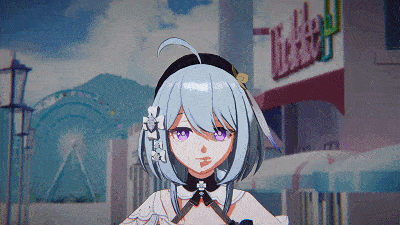

# FernNPR
FernNPR is a NPR rendering library in Unity(UE in the future), not just cartoon rendering, It will include as many non-realistic rendering techniques as possible.

It will be an easily scalable, multi-platform (PC/Mobile) rendering library.

## Render Example
There are some simple scenes.

### NPR Character

Model From: [模之屋](https://www.aplaybox.com/details/model/S5d7KiigvyIb)

Background From: [GameVision Studios](https://gamevision.artstation.com/projects/ZGZxYG)

### Material Example

FernNPR makes it easy to get various styles of materials, including NPR and PBR.

### Aniso Hair

### Angle Ring Specular

### Toon Eye Shader

### Face Shading
**Easy way to fix Face lighting**

**SDF Face**

### Depth Shadow 

Use trick of depth to get Clear shadow

Hair Shadow Example

### Depth Offset Rim

Depth Offset allows Rim Light's width to remain consistent in screen space.

### More

If you are interested in this project, welcome to contact me, thanks!

#### Next
- Skin
- Fabric
- Art Tool
- Post Processing
- More PBR Shader

## Related links

- [LWGUI](https://github.com/JasonMa0012/LWGUI)

- [VRoid Studio](https://vroid.com/en)
