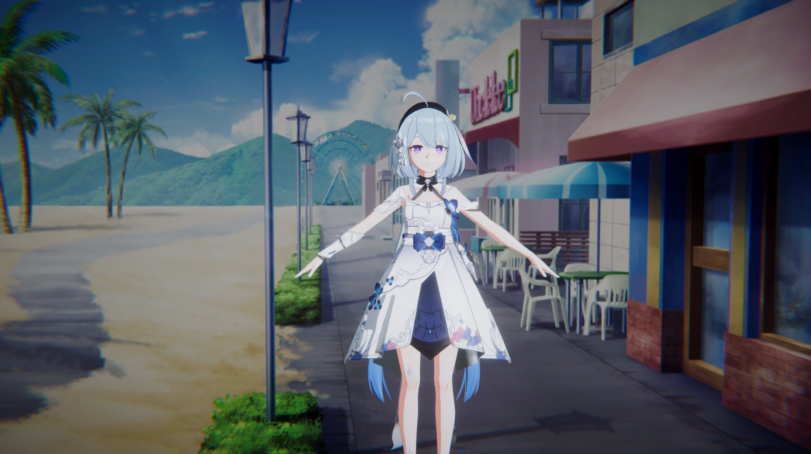

# Unity NPR Render Library
NPR rendering Library for mobile, include character rendering, scene rendering, etc.

Sorry I'm very busy and slow to update...

### Render Example
There are some simple scenes, I am busy with the implementation of the function, and no time for art creation.

Model From: [模之屋](https://www.aplaybox.com/details/model/S5d7KiigvyIb)

#### Aniso Hair

#### simple material

### Next

- Hair
- Face
- Fabric
- Socks
- Skin
- Post Processing

...

If you are interested in this project, welcome to contact me, thanks!

## Related links

- [LWGUI](https://github.com/JasonMa0012/LWGUI)

- [VRoid Studio](https://vroid.com/en)
