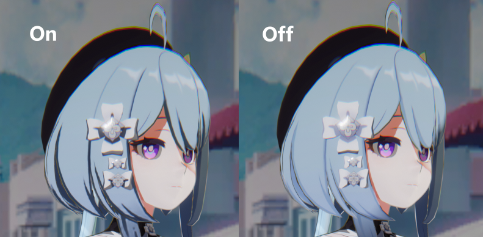
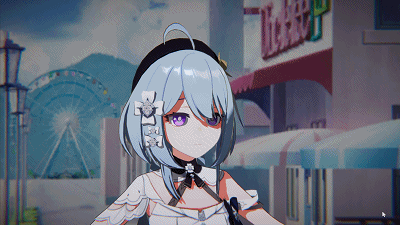

# FernNPR
FernNPR is a NPR rendering library in Unity, not just cartoon rendering, It will include as many non-realistic rendering techniques as possible.

It will be an easily scalable, multi-platform (PC/Mobile) rendering library.

## Render Example
There are some simple scenes.

#### NPR Character

Model From: [模之屋](https://www.aplaybox.com/details/model/S5d7KiigvyIb)

#### Diffuse Occlusion

#### Aniso Hair

#### Angle Ring Specular

#### Toon Eye Shader

(Next is the PBR Eye shader)

#### More
Some features are not given source code for now, I will finish all features as soon as possible.

If you are interested in this project, welcome to contact me, thanks!

#### Next
- Face Shader
- Skin
- Fabric
- Art Tool
- Post Processing
- More PBR Shader

Sorry I'm very busy and slow to update...

## Related links

- [LWGUI](https://github.com/JasonMa0012/LWGUI)

- [VRoid Studio](https://vroid.com/en)
