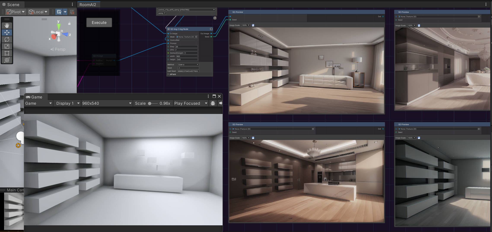

------------------------------------

# FernNPR

[中文](https://github.com/DeJhon-Huang/FernNPR/blob/master/README_CN.md) | [English](https://github.com/DeJhon-Huang/FernNPR/blob/master/README.md)

FernNPR is a library for non-photorealistic rendering (NPR) in Unity. It offers a variety of NPR techniques, Character Renderering, Environmental Renderering, and Stable Diffusion!
___

## Example
There are some showcase.

Model From: [模之屋](https://www.aplaybox.com/details/model/S5d7KiigvyIb), Background From: [GameVision Studios](https://gamevision.artstation.com/projects/ZGZxYG)

FernNPR can easy get various styles of materials, including NPR and PBR.

### More Example

If you want to see more examples, please visit [More Example](https://github.com/DeJhon-Huang/FernNPR/wiki/More-Example) on the [Wiki](https://github.com/DeJhon-Huang/FernNPR/wiki)
___

## Fern SD Graph

Fern SD Graph is a Graph tool integrated in Unity, which can obtain the scene information of Unity and generate images using Stable Diffusion.

[More Example](https://github.com/DeJhon-Huang/FernNPR/wiki/Stable-Graph-Example)

### Note

SD Graph has been moved to this repository: https://github.com/FernRender/FernSDGraph

___

## Tool
There are some useful tool.

### SmoothNormal And Texture Baker

This tool was developed by [DumoeDss](https://github.com/DumoeDss).

Smooth Normals is used to solve the problem of stroke breakage due to unsmooth model normals in runtime or editor. For more information, you can check [here](https://github.com/DumoeDss/AquaSmoothNormals).

Texture Baker can bake textures onto a mesh.

### Requirements

1. Open **Window** -> **Package Manager**
2. Click **+** Button
3. Add package by name
4. Add: **com.unity.jobs**
5. Add: **com.unity.nuget.newtonsoft-json**
___

## Related links

- [BiliBili](https://space.bilibili.com/477693184)

- [知乎专栏](https://www.zhihu.com/column/c_1587028302690304000)

- [LWGUI](https://github.com/JasonMa0012/LWGUI)
